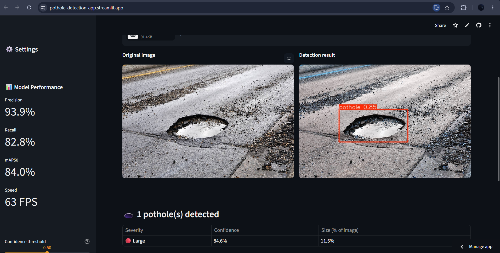

# 🕳️ Real-Time Pothole Detection & Smart Road Monitoring System

AI-powered web application that detects potholes in road images using a custom-trained YOLOv8 model, classifies severity, and generates a Road Health Score — built as part of the Edunet Foundation × IBM SkillsBuild × AICTE AI Internship 2026.

🔗 **Live App:** [pothole-hema.streamlit.app](https://pothole-detection-app.streamlit.app/)

---

## 📸 Preview

---

## 🎯 Features

- 🔍 Real-time pothole detection on uploaded road images
- 🎨 Severity classification — Small / Medium / Large (color-coded bounding boxes)
- 🛣️ Road Health Score (0–100) with letter grade (A–F)
- 🎛️ Adjustable confidence threshold
- ⬇️ Downloadable annotated results
- 🌙 Custom dark dashboard UI

---

## 📊 Model Performance

| Metric | Score |
|---|---|
| Precision | 93.9% |
| Recall | 82.8% |
| F1 Score | 88.0% |
| mAP50 | 84.0% |
| mAP50-95 | 48.6% |
| Inference Speed | ~16ms (63 FPS) |

Model: **YOLOv8s**, fine-tuned via transfer learning on a custom 1,455-image pothole dataset (Roboflow).

---

## 🛠️ Tech Stack

`Python` · `YOLOv8 (Ultralytics)` · `OpenCV` · `Streamlit` · `NumPy` · `Pillow` · `Google Colab`

---

## 📁 Project Structure

pothole-detection-app/

├── app.py              # Streamlit application

├── best.pt              # Trained YOLOv8 model weights

├── requirements.txt     # Python dependencies

├── .streamlit/

│   └── config.toml      # Dark theme configuration

└── README.md

---

## 👩‍💻 Author

**HEMAVARSHINI M**  
Electronics and Communication Engineering (ECE)
RMD Engineering College
Edunet Foundation × IBM SkillsBuild × AICTE AI Internship 2026
